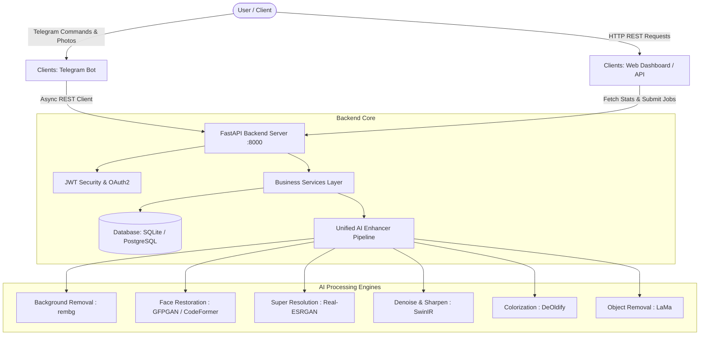

# 🚀 Zenemoo AI - AI-Powered Image Enhancement Platform

[](https://python.org)
[](https://fastapi.tiangolo.com)
[](https://python-telegram-bot.org)
[](https://pytorch.org)
[](LICENSE)

**Zenemoo AI** is an enterprise-grade, clean-architecture AI Image Enhancement platform. It features a **Decoupled Telegram Bot Client**, a **FastAPI REST API Backend**, a **Web Admin Dashboard**, and a **Modular Deep Learning Processing Subsystem**.

---

## 🌟 Key Features

1. **🎭 Face Restoration**: Low-resolution portrait sharpening and facial landmark reconstruction using **GFPGAN v1.4** and **CodeFormer** (with adjustable fidelity controls).
2. **🔍 Super Resolution Upscaling**: High-definition 2x and 4x image upscaling powered by **Real-ESRGAN**.
3. **🖼️ Automatic Background Removal**: Transparent PNG mask generation and alpha matting powered by **rembg** (U²-Net).
4. **⚡ Denoising & Sharpening**: Adaptive unsharp masking and noise reduction using **SwinIR** & OpenCV.
5. **🎨 Black & White Colorization**: Legacy photo colorization powered by **DeOldify**.
6. **🪄 Object Removal / Inpainting**: Deep learning mask-based object removal powered by **LaMa**.
7. **📦 Smart Compression**: Intelligent WebP/JPEG/PNG format optimization.
8. **📊 Web Admin Dashboard**: Real-time telemetry monitoring total users, processed image counts, PyTorch GPU/VRAM memory usage, CPU/RAM stats, storage disk breakdown, and live processing audit logs.
9. **🤖 Decoupled Telegram Bot Client**: High-performance bot client (`python-telegram-bot` v22+) communicating **exclusively via REST API** with the backend.

---

## 🏛️ System Architecture



---

## 📁 Repository Structure

```
ZenemooAI/
│
├── backend/                       # Core FastAPI & AI Processing Subsystem
│   ├── api/                       # REST Endpoints, Pydantic Schemas, Middlewares
│   ├── ai/                        # Deep Learning Model Engines & Pipelines
│   │   ├── enhancer/              # Unified Pipeline Orchestrator
│   │   ├── background/            # rembg (U2-Net) Engine
│   │   ├── restore/               # GFPGAN & CodeFormer Engines
│   │   ├── upscale/               # Real-ESRGAN (2x/4x) Engine
│   │   ├── sharpen/               # SwinIR & Sharpen Engine
│   │   ├── compress/              # Compression Engine
│   │   ├── colorize/              # DeOldify Colorization Engine
│   │   └── object_remove/         # LaMa Inpainting Engine
│   ├── services/                  # Business Logic Layer (Image, Storage, User, Job)
│   ├── database/                  # SQLAlchemy ORM Models & DB Sessions
│   └── workers/                   # Async Background Workers
│
├── clients/                       # Decoupled Frontend Clients
│   ├── telegram/                  # Telegram Bot (Communicates ONLY with Backend API)
│   └── web/                       # Web Admin Dashboard (HTML5, Vanilla CSS, JS)
│
├── shared/                        # Common System Infrastructure
│   ├── config/                    # Environment configs (development, production, gpu, cpu)
│   ├── exceptions/                # Domain-Specific Exception Classes
│   ├── utils/                     # Utility modules (image, validators, paths, gpu, timer)
│   └── weights/                   # Model Weights Manager & Auto-Downloader
│
├── uploads/                       # Input image uploads
├── outputs/                       # Final enhanced image output storage
├── temp/                          # Intermediate pipeline temporary files
├── tests/                         # Automated unit & integration tests
├── Dockerfile                     # Multi-stage production container build
├── docker-compose.yml             # Container orchestration manifest
├── requirements.txt               # Python package specifications
└── main.py                        # Unified application launcher
```

---

## 🚀 Quick Start & Installation

### 1. Prerequisites
- Python 3.11+
- PyTorch (CUDA GPU optional, automatic CPU fallback enabled)

### 2. Setup Virtual Environment
```bash
git clone https://github.com/your-org/ZenemooAI.git
cd ZenemooAI

python -m venv venv
# Windows:
.\venv\Scripts\activate
# Linux/macOS:
source venv/bin/activate

pip install -r requirements.txt
```

### 3. Configure Environment Variables
Copy `.env.example` to `.env` and fill in your Telegram Bot Token:
```env
BOT_TOKEN="your_telegram_bot_token_here"
DATABASE_URL="sqlite+aiosqlite:///./zenemoo.db"
DEVICE="auto"
```

### 4. Running the Platform

#### Start FastAPI Backend REST API Server & Web Dashboard
```bash
python main.py --api
```
- **REST API Swagger Documentation**: `http://localhost:8000/docs`
- **Web Admin Dashboard**: `http://localhost:8000/dashboard`

#### Start Decoupled Telegram Bot Client
```bash
python main.py --bot
```

---

## 🐳 Docker Deployment

Deploy the entire stack (FastAPI Backend + Telegram Bot + PostgreSQL Database) using Docker Compose:

```bash
docker-compose up --build -d
```

Check running services:
```bash
docker-compose ps
```

---

## 🧪 Automated Testing

Execute the test suite using `pytest`:
```bash
pytest tests/
```

---

## 📄 License

Distributed under the MIT License. See `LICENSE` for details.
