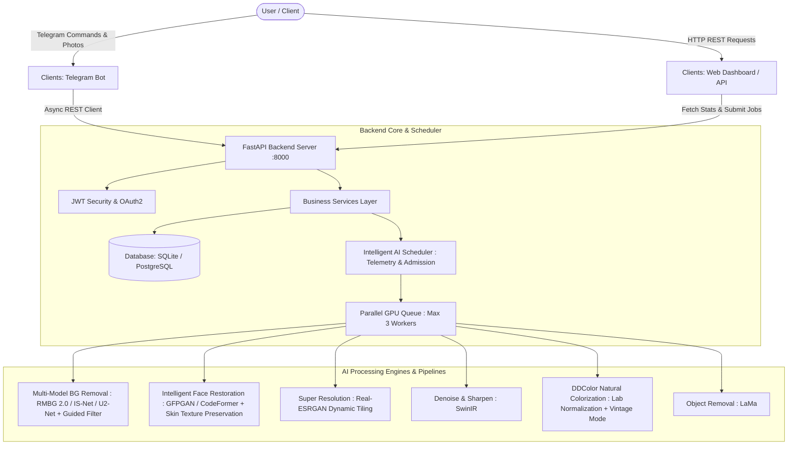

# 🚀 Zenemoo AI - AI-Powered Image Enhancement Platform

[](https://python.org)
[](https://fastapi.tiangolo.com)
[](https://python-telegram-bot.org)
[](https://pytorch.org)
[](LICENSE)
[](mailto:contact@mrprem.in)

**Zenemoo AI** is an enterprise-grade, clean-architecture AI Image Enhancement platform. It features a **Decoupled Telegram Bot Client**, a **FastAPI REST API Backend**, a **Web Admin Dashboard**, and a **Modular Deep Learning Processing Subsystem**.

---

## 🌟 Key Features

1. **🎭 Intelligent Face Enhancement**: Multi-face detection, per-face quality scoring ($Q \in [0.0, 1.0]$), and adaptive pipeline selection (`excellent` $\to$ skip restoration, `medium` $\to$ GFPGAN light, `poor` $\to$ CodeFormer adaptive fidelity $w \in [0.30, 0.85]$, `very_poor` $\to$ GFPGAN + CodeFormer dual pass). Features independent 30% margin face cropping, Gaussian elliptical mask blending, 20% natural skin texture preservation (zero plastic skin), and post-restoration quality auto-retry fallback.
2. **🖼️ Production-Grade Background Removal**: Multi-model classification engine (`portrait` $\to$ `u2net_human_seg` / `bria-rmbg-2.0`, `product` $\to$ `isnet-general-use`, `anime` $\to$ `isnet-anime`, `general` $\to$ `u2net`). Includes facial feature protection (prevents missing ears/fingers), OpenCV Fast Guided Filter matting, high-pass hair detail preservation, 1–2 px feathering, confidence quality scoring ($S \in [0.0, 1.0]$), and automatic retry fallback.
3. **🎨 Natural B&W Photo Colorization & Restoration**: DDColor / DeOldify neural colorization integrated with pre-processing (denoising, pre-face restoration, low-res upscaling), CIE Lab color normalization (Gray World white balance, human skin tone bounds $a^* \in [3, 22]$, red cast reduction, $Y$ luminance channel re-injection for 100% sharpness preservation), post-colorization face refinement, low confidence fallback, and optional **Vintage Mode** for warm historical aesthetics.
4. **⚡ Parallel GPU Processing & Intelligent AI Scheduler**: Concurrency engine with `MAX_GPU_WORKERS = 3` parallel worker pool and mode-specific semaphores (Fast 2x limit 2, Full HQ 4x limit 1, Background removal limit 3). Features pre-job dynamic admission checks (**Free VRAM > 1.5 GB**, **GPU Util < 90%**, **Temp < 80°C**), dynamic thermal worker scaling, pipeline parallelism, smart stage skipping, and dynamic VRAM tile sizing (256px to 1024px).
5. **🔍 Super Resolution Upscaling**: High-definition 2x and 4x image upscaling powered by **Real-ESRGAN** with dynamic tile allocation based on available VRAM.
6. **⚡ Denoising & Sharpening**: Adaptive unsharp masking and noise reduction using **SwinIR** & OpenCV.
7. **🪄 Object Removal / Inpainting**: Deep learning mask-based object removal powered by **LaMa**.
8. **📦 Smart Compression**: Intelligent WebP/JPEG/PNG format optimization.
9. **📊 Web Admin Dashboard**: Real-time telemetry monitoring total users, processed image counts, PyTorch GPU/VRAM memory usage, CPU/RAM stats, storage disk breakdown, and live processing audit logs.
10. **🤖 Decoupled Telegram Bot Client**: High-performance bot client (`python-telegram-bot` v22+) communicating **exclusively via REST API** with the backend.

---

## 🏛️ System Architecture



---

## 📁 Repository Structure

```
ZenemooAI/
│
├── backend/                       # Core FastAPI & AI Processing Subsystem
│   ├── api/                       # REST Endpoints, Pydantic Schemas, Middlewares
│   ├── ai/                        # Deep Learning Model Engines & Pipelines
│   │   ├── enhancer/              # Unified Pipeline Orchestrator
│   │   ├── background/            # rembg (U2-Net) Engine
│   │   ├── restore/               # GFPGAN & CodeFormer Engines
│   │   ├── upscale/               # Real-ESRGAN (2x/4x) Engine
│   │   ├── sharpen/               # SwinIR & Sharpen Engine
│   │   ├── compress/              # Compression Engine
│   │   ├── colorize/              # DeOldify Colorization Engine
│   │   └── object_remove/         # LaMa Inpainting Engine
│   ├── services/                  # Business Logic Layer (Image, Storage, User, Job)
│   ├── database/                  # SQLAlchemy ORM Models & DB Sessions
│   └── workers/                   # Async Background Workers
│
├── clients/                       # Decoupled Frontend Clients
│   ├── telegram/                  # Telegram Bot (Communicates ONLY with Backend API)
│   └── web/                       # Web Admin Dashboard (HTML5, Vanilla CSS, JS)
│
├── shared/                        # Common System Infrastructure
│   ├── config/                    # Environment configs (development, production, gpu, cpu)
│   ├── exceptions/                # Domain-Specific Exception Classes
│   ├── utils/                     # Utility modules (image, validators, paths, gpu, timer)
│   └── weights/                   # Model Weights Manager & Auto-Downloader
│
├── uploads/                       # Input image uploads
├── outputs/                       # Final enhanced image output storage
├── temp/                          # Intermediate pipeline temporary files
├── tests/                         # Automated unit & integration tests
├── Dockerfile                     # Multi-stage production container build
├── docker-compose.yml             # Container orchestration manifest
├── requirements.txt               # Python package specifications
└── main.py                        # Unified application launcher
```

---

## 🚀 Quick Start & Installation

### 1. Prerequisites
- Python 3.11+
- PyTorch (CUDA GPU optional, automatic CPU fallback enabled)

### 2. Setup Virtual Environment
```bash
git clone https://github.com/your-org/ZenemooAI.git
cd ZenemooAI

python -m venv venv
# Windows:
.\venv\Scripts\activate
# Linux/macOS:
source venv/bin/activate

pip install -r requirements.txt
```

### 3. Configure Environment Variables
Copy `.env.example` to `.env` and fill in your Telegram Bot Token:
```env
BOT_TOKEN="your_telegram_bot_token_here"
DATABASE_URL="sqlite+aiosqlite:///./zenemoo.db"
DEVICE="auto"
```

### 4. Running the Platform

#### Start FastAPI Backend REST API Server & Web Dashboard
```bash
python main.py --api
```
- **REST API Swagger Documentation**: `http://localhost:8000/docs`
- **Web Admin Dashboard**: `http://localhost:8000/dashboard`

#### Start Decoupled Telegram Bot Client
```bash
python main.py --bot
```

---

## 🐳 Docker Deployment

Deploy the entire stack (FastAPI Backend + Telegram Bot + PostgreSQL Database) using Docker Compose:

```bash
docker-compose up --build -d
```

Check running services:
```bash
docker-compose ps
```

---

## 🧪 Automated Testing

Execute the test suite using `pytest`:
```bash
pytest tests/
```

---

## 📄 License & Proprietary Rights

Copyright © 2026 **Zenemoo AI**. All Rights Reserved.

This software is protected under an **Enterprise Proprietary & Commercial License**. 
No commercial use, SaaS deployment, hosting, redistribution, reverse engineering, or public service deployment is permitted without prior explicit written authorization.

For enterprise licensing inquiries, commercial permissions, or partnership authorization, contact:
- 📧 **Email**: [contact@mrprem.in](mailto:contact@mrprem.in)
- 📜 **Full License Details**: See [LICENSE](LICENSE)
